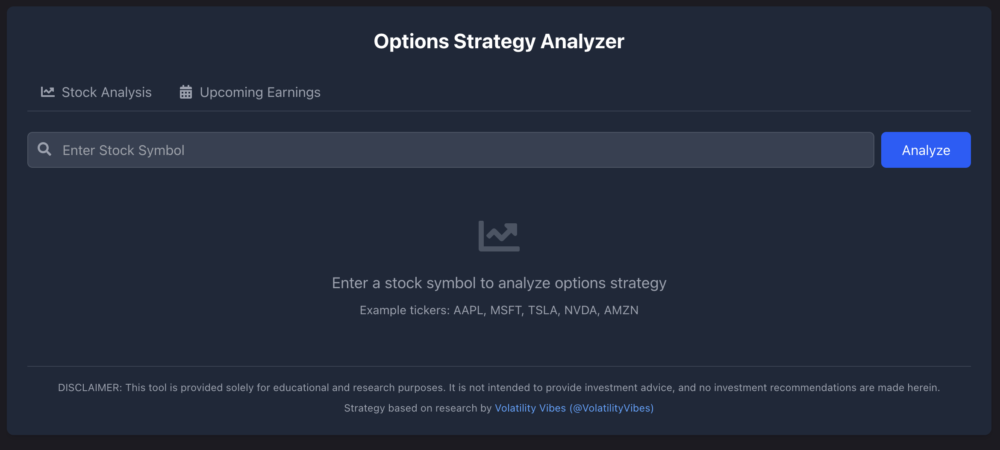

# Options Spread Strategy Tool

> **Credit:** This strategy is based on research by [Volatility Vibes (@VolatilityVibes)](https://www.youtube.com/watch?v=oW6MHjzxHpU) and their work on earnings volatility trading. The original methodology, analysis, and criteria used in this tool are derived from their research. This application is simply a frontend wrapper for their strategy (with some added LLM sprinkled in).

A web application for analyzing stocks to identify potential options spread opportunities, especially for earnings plays. The tool analyzes stock volatility patterns, upcoming earnings, and options data to help identify trading opportunities based on specific criteria.



## Features

- **Stock Analysis:** Evaluates stocks against specific volatility and liquidity criteria
- **Automated Recommendations:** Categorizes stocks as "Recommended", "Consider", or "Avoid" for options strategies
- **Term Structure Analysis:** Visualizes the options volatility term structure curve
- **Expected Move Calculator:** Estimates the market's expected price movement for a stock
- **Volatility Comparison:** Compares implied volatility to historical realized volatility
- **Upcoming Earnings Finder:** Identifies and sorts upcoming earnings releases by date, sector, and other criteria

## Technologies Used

### Backend
- Python
- Flask (Web server)
- yfinance (Financial data)
- Pandas/NumPy (Data analysis)
- Perplexity Sonar API (Earnings data)

### Frontend
- React
- TailwindCSS (Styling)
- Recharts (Interactive charts)
- React Tabs

## Installation

### Prerequisites

- Python 3.9+
- Node.js 18+
- npm or yarn

### Backend Setup

1. Clone the repository:
   ```
   git clone https://github.com/MattNeto928/volatility-vibes-options-strategy.git
   cd options-spread-strategy
   ```

2. Create and activate a virtual environment:
   ```
   python -m venv venv
   source venv/bin/activate  # On Windows: venv\Scripts\activate
   ```

3. Install dependencies:
   ```
   pip install -r requirements.txt
   ```

4. Create a `.env` file in the root directory with your API keys:
   ```
   PERPLEXITY_API_KEY=your_api_key_here
   ```

5. Start the Flask server:
   ```
   python server.py
   ```

### Frontend Setup

1. Navigate to the React app directory:
   ```
   cd options-spread-ui
   ```

2. Install dependencies:
   ```
   npm install
   ```

3. Start the development server:
   ```
   npm run dev
   ```

4. Open your browser and navigate to:
   ```
   http://localhost:5173
   ```

## Strategy Calculation Logic

The application evaluates three key metrics to determine if a stock is suitable for options strategies:

1. **Average Volume:** Must exceed 1.5M shares daily (ensures liquidity)
2. **IV30/RV30 Ratio:** The 30-day implied volatility divided by 30-day realized volatility must exceed 1.25 (identifies elevated option premiums)
3. **Term Structure Slope:** The slope of the volatility term structure from current to 45 days must be less than -0.00406 (indicates volatility skew)

Recommendations are determined as follows:
- **Recommended:** All three criteria passed
- **Consider:** Term structure passed, plus either volume OR IV/RV ratio
- **Avoid:** Two or more failed criteria

## API Documentation

The Flask backend provides the following endpoints:

- `GET /analyze/<ticker>`: Full analysis of a stock ticker
- `GET /analyze-simple/<ticker>`: Simplified analysis for better performance
- `GET /upcoming-earnings`: Returns upcoming earnings release data
- `GET /test/<ticker>`: Tests connection to the stock API

See [API Documentation](docs/API.md) for detailed request/response formats.

## Configuration

You can adjust trading parameters by modifying constants in the backend code:

- **Volume Threshold:** `server.py` line ~692 (default: 1.5M)
- **IV/RV Ratio Threshold:** `server.py` line ~693 (default: 1.25)
- **Term Structure Slope Threshold:** `server.py` line ~694 (default: -0.00406)

## Contributing

Contributions are welcome! Please feel free to submit a Pull Request.

1. Fork the repository
2. Create your feature branch (`git checkout -b feature/amazing-feature`)
3. Commit your changes (`git commit -m 'Add some amazing feature'`)
4. Push to the branch (`git push origin feature/amazing-feature`)
5. Open a Pull Request

## Legal Disclaimer

This tool is provided solely for educational and research purposes. It is not intended to provide investment advice, and no investment recommendations are made herein. The developers are not financial advisors and accept no responsibility for any financial decisions or losses resulting from the use of this software.

## License

This project is licensed under the MIT License - see the [LICENSE](LICENSE) file for details.